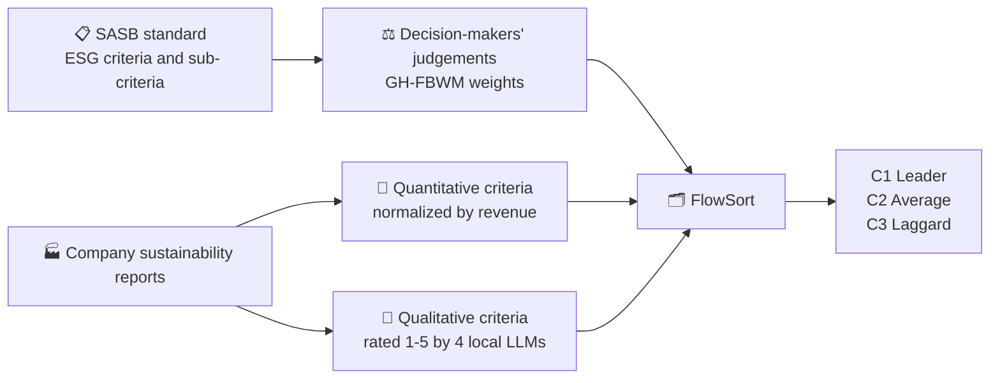

# 🌱 Sustainable Partner Selection Decision Support

A decision-support tool that provides recommendations for decision-makers in the sustainable partner selection process.
It integrates a group-hierarchical fuzzy Best-Worst method (GH-FBWM) for criteria weighting, LLMs, and the FlowSort method for candidate sorting.


This repository holds the prompts, the two sensitivity analyses, and the code
behind them, so anyone can rerun the study from scratch.

---

## 🎯 How the decision-support tool works


**1. Criteria selection.** The criteria come from the [SASB](https://sasb.ifrs.org/) standard for the Semiconductors
sector. 

**2. Criteria weighting.** Decision-makers compare criteria against
each other, and the **GH-FBWM** model turns those comparisons into weights. Three things about it are worth knowing:

- *Best-Worst* — a decision-maker identifies the most and the
  least important criterion and compares everything to those two. 
- *Fuzzy* — judgments are given as linguistic terms converted into triangular fuzzy numbers.
- *Group* — group decision-making approach.
- *Hierarchical* — the criteria sit in a two-level hierarchy of `SASB topic → SASB indicator`.

**3. Score each company on each criterion.** Two types of criteria:

- **Quantitative** criteria are extracted from the company's sustainability reports and normalized by total revenue,
  so a large company and a small one can be compared.
- **Qualitative** criteria are extracted from the company's sustainability reports and scored
  by LLMs running *locally* against a fixed scoring rubric (1 to 5).
  Four different models rate every disclosure, 100 times each.

**4. Sort the companies into categories.** A method called **FlowSort** compares
each candidate against reference profiles and places it in one of three ordered
categories: **C1 Leader**, **C2 Average**, **C3 Laggard**.



---

## 🔍 Sensitivity analysis


**💬 Does the prompt provided for LLMs influence the result?**
The qualitative disclosures are rated by an LLM. The study
asks in four different ways and compares the sorting output. 

| prompt | includes the SASB guidance? | includes the 1-5 rubric? |
| --- | --- | --- |
| `prompt_1` | ✅ yes | ✅ yes |
| `prompt_2` | ❌ no | ✅ yes |
| `prompt_3` | ✅ yes | ❌ no |
| `prompt_4` | ❌ no | ❌ no |

**⚖️ Does the result depend on the criteria weights?**
Robustness was assessed through a Monte Carlo simulation with 10,000 iterations. 
In each run, all weights were randomly varied within ±20% of their original values; the sorting output was recomputed, 
and robustness was measured as the proportion of runs that reproduced the original result.

---

## 📦 What this repository contains

This repository includes the four prompts, two sensitivity analyses, the supporting methods and code for GH-FBWM,
FlowSort, and scoring, as well as the server that exposes these components as tools.

---

## 🛠️ Before you start

Everything below is typed into the **Terminal** app, one boxed line at a time,
from inside the project folder. You will need:

- 🐍 **Python 3.12** (tested on 3.12.13)
- 🤖 **[Ollama](https://ollama.com)** — free software that runs LLMs on your
  own computer. 

Create an isolated Python environment and install what the code needs:

```bash
python3 -m venv .venv312
```

```bash
.venv312/bin/python -m pip install -r requirements.txt
```

Start Ollama and download the four models. The names must match exactly —
they are recorded on every single rating:

```bash
ollama serve
```

```bash
ollama pull llama3.1:8b && ollama pull qwen3.5:9b && ollama pull deepseek-v2:16b && ollama pull gemma4:12b
```

---

## 📁 Data to provide

No company data is distributed with this repository. Create a folder named
`data/` in the project root and put these five files in it. Each is a JSON file
containing a list of records — plain text you can open in any editor.

| file | what it holds | fields in each record |
| --- | --- | --- |
| `sasb_semiconductors_metadata.json` | the criteria: one record per SASB indicator | `code`, `measure`, `topic`, `domain`, `quantity`, `category`, `explanation` (the guidance text shown to the LLM), `search_terms` |
| `measures_HITL.json` | the **candidate partners** being classified: one record per company + indicator | `code`, `company`, `measure`, `value`, `unit`, `page`, `confidence` |
| `corrected_all.json` | the **reference pool** the category boundaries are computed from — same format, a wider set of companies | `code`, `company`, `measure`, `value`, `unit`, `page`, `confidence` |
| `financial_HITL_equipment.json` | revenue, used to normalise the numbers | `company`, `fiscal_year`, `fiscal_period_end`, `standardized_metric` (`total_revenue`), `reported_metric`, `currency`, `value_millions`, `value` |
| `convertion.json` | currency conversion to US dollars | `currency`, `usd_per_1_local_currency`, `average_rate_2024_local_per_usd` |


---

## ⚙️ The study settings

| setting | value | where it is |
| --- | --- | --- |
  | 🤖 LLMs | `llama3.1:8b`, `qwen3.5:9b`, `deepseek-v2:16b`, `gemma4:12b` | `rating_evaluation/prompt_sensitivity.py` |
| 🌡️ temperature | `0.0` — the least random setting, so answers are as repeatable as the model allows | `prompt_sensitivity.py` |
| 🔁 iterations | 100 per LLM, per prompt, per disclosure | `DEFAULT_ITERATIONS` |
| 🔢 rating scale and prompts | whole numbers 1 to 5 | `rating_evaluation/prompts.py` |
| ⚖️ criterion weights | the study's GH-FBWM vector | `flowsort.py` (`GH_FBWM_STUDY_WEIGHTS`) |
| 🗂️ sorting setup | limiting profiles, net flow, `t1` preference function | `flowsort.py` |
| 🏷️ categories | `C1` Leader, `C2` Average, `C3` Laggard | `flowsort.py` |
| 🎲 Monte Carlo simulation | 10,000, drawn uniformly | `sensitivity_analysis.py` |
| 📏 weight perturbation | ±20% (`--pct 0.20`, the command default) | `run_weight_monte_carlo.py` |
| 🌱 random seed | 42 — fixes the random draws so the simulation repeats exactly | `run_weight_monte_carlo.py` |

---

## 💬 Prompts

The four prompt texts live in
`src/decision_support_mcp/rating_evaluation/prompt_sensitivity_prompts.py`

`prompt_1` is the study's baseline.

---

## ▶️ Reproducing the study

Run these in order from the project folder, with Ollama running.


**1️⃣ Collect the qualitative ratings.** ⏳ 

```bash
.venv312/bin/python scripts/run_prompt_sensitivity.py collect
```

**2️⃣ Compare the prompts.** Combines the ratings, classifies the companies under
each prompt, and measures how much the prompts disagree. 

```bash
.venv312/bin/python scripts/run_prompt_sensitivity.py report
```

**3️⃣ Classify per LLM as well as per prompt.** 

```bash
.venv312/bin/python scripts/run_flowsort_by_model.py
```

**4️⃣ Run the weight simulation.** 🎲 10,000 redraws of the weights at ±20%,
on the combined ratings of the four models.

```bash
.venv312/bin/python scripts/run_weight_monte_carlo.py run --series median --samples 10000 --pct 0.20
```

The variant below repeats the identical simulation for each model separately, at
several perturbation sizes and several random seeds.

```bash
.venv312/bin/python scripts/run_weight_monte_carlo.py by-series --samples 10000 --pcts 0.05 0.10 0.15 0.20 --seeds 42 1 7 123
```


## 🖥️ Using the tool itself

The code runs a decision-support tool. It is an **MCP server**: 

```bash
.venv312/bin/python server.py
```

`client.py` is a command-line client for the same server. Before it can classify
anything, the qualitative ratings have to exist.

---

## 🗂️ What's in each file

```
server.py                          exposes everything as callable tools
client.py                          command-line client for the server
src/decision_support_mcp/
  sasb.py                          the SASB criteria and their topic tree
  bwm_tfn.py                       GH-FBWM: decision-makers' judgements → weights
  quantitative_scores.py           reads the data, normalises it, builds the category boundaries
  qualitative_scores.py            rates text disclosures with a local LLM
  flowsort.py                      FlowSort sorting + the study's weight vector
  sensitivity_analysis.py          the weight Monte Carlo simulation
  rating_evaluation/
    prompts.py                     the baseline prompt and the 1-5 rubric
    prompt_sensitivity_prompts.py  the four prompt variants
    prompt_sensitivity.py          the prompt comparison
    collect.py                     the LLM rating collection loop
    dataset.py                     which company + indicator pairs get rated
    agreement.py                   agreement statistics and the median
scripts/                           the commands used above
```

---

## 📄 Citation and license

To be added.
